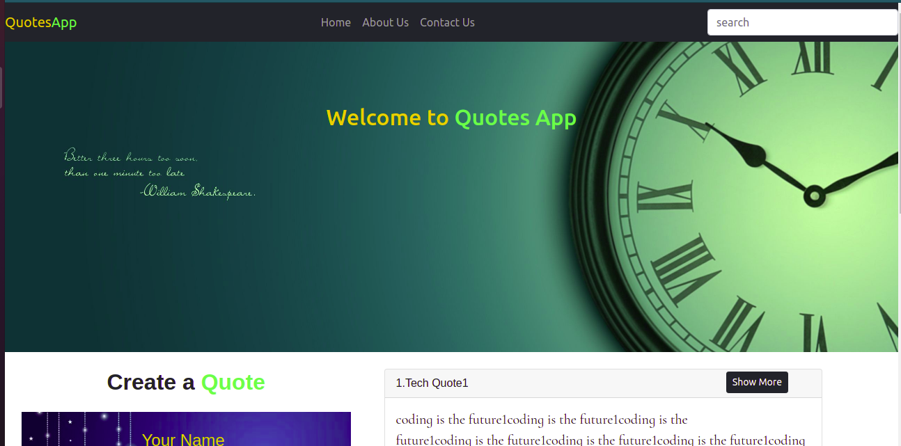
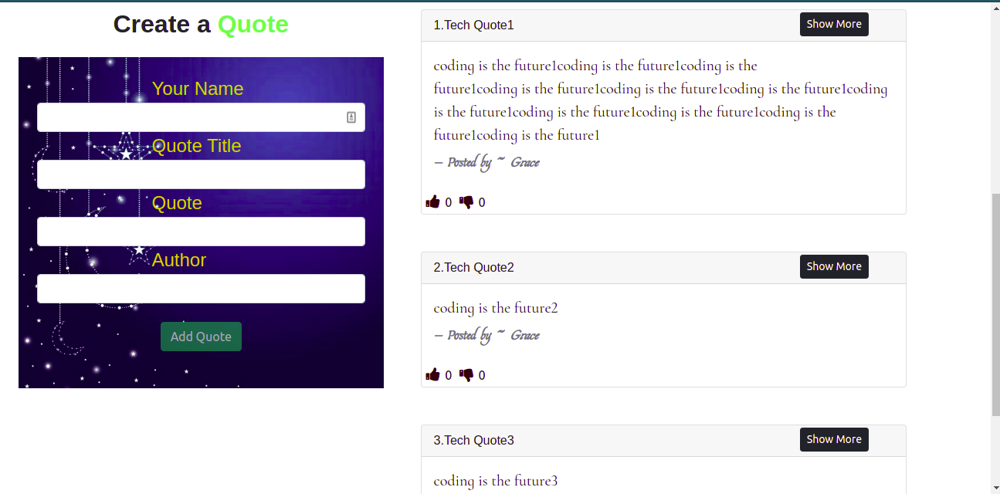

# Quotes Creating abd rating Application

## Live Link

https://gracemwende.github.io/Quotes-Ng/

#### Application Description

Application where users can create quotes and have those quotes voted on whether they are terrible or are inspirational.

## Project picture

#### By **List of contributors**

@GraceMwende

#### BDD

- see Quotes created before
- Vote on whether they are inspirational or terrible
- Delete a quote
- Create a quote
- Highlight quote with the highest upvotes

## Known Bugs

Background image of the form not visible on deployment

## Setup/Installation Requirements

- Do a git clone of the repo to your local machine:
  git clone https://github.com/GraceMwende/Quotes-Ng.git
- Run 'npm install' to install node modules
- run 'ng serve -o' to open in browser

## Technologies Used

- Angular
- CSS
- Bootstrap
- Typescript

## Support and contact details

Please contact me incase of anything

### License

This project is licensed under the terms of the MIT license.
Copyright (c) 2021
